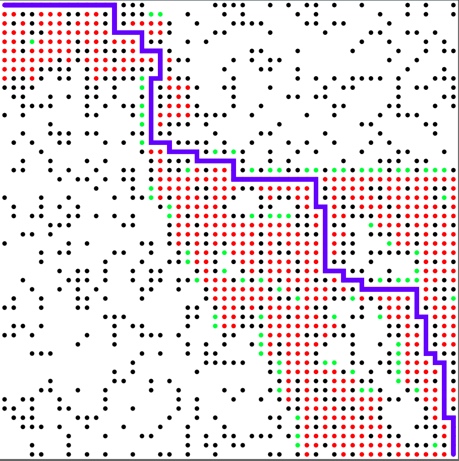
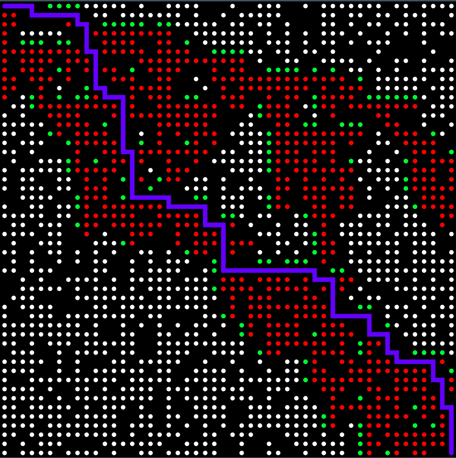
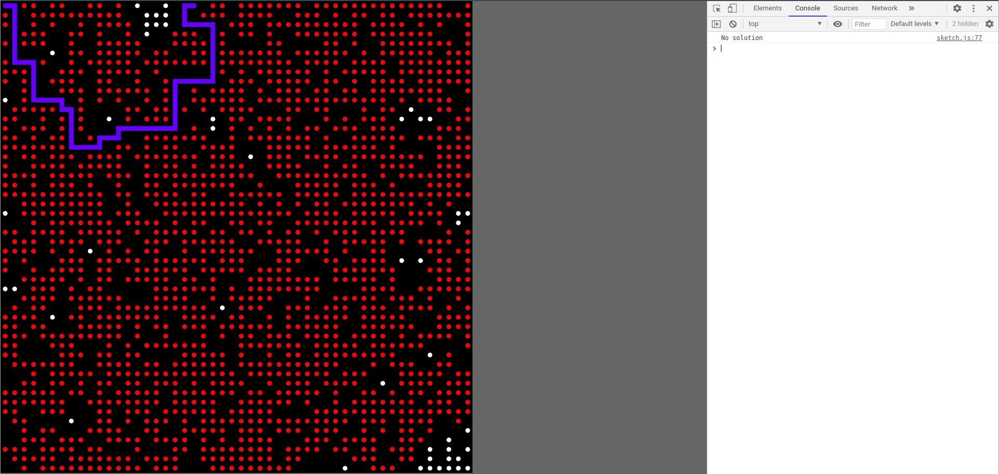

# Introduction


The A-star project is such in which the A* pathfinder algorithm is implemented in order to find the shortest path from the top-left corner to the bottom-right corner of a grid of nodes.  The grid randomly spawns obstacles and the aforementioned graph traversal algorithm will either find the shortest path to the bottom-right node or run out of paths to pursue.

# Index
- [About](#About)
- [Usage](#Usage)
    - [Dependencies](##Dependencies)
    - [Installation](##Installation)
- [Resources](#Resources)
- [Gallery](#Gallery)
- [Licence](#Licence)

# About
A* is an informed search algorithm (also known as best-first search algorithm). This means that it makes use of a grid of weighted points, or nodes. Each node, given a starting node, has a score associated with it, related to values like the least distance travelled, shortest time, etc. The algorithm takes this score into account and chooses which nodes to go through, until the goal node has been reached or no suitable paths have been found. A* was created with the goal of building a mobile robot that could devise a set of actions to take, as part of the Shakey project.

# Usage
In order to run the program, `p5.js` libraries must be generated and and the content of the repository must be copied into the directory with the generated `p5.js` libraries. A local server can be set up to in order to serve the `sketch.js` file and watch the algorithm run on the localhost, assuming dependencies are installed.

## Dependencies
- Node.js
- `p5.js`
- `http-server` (optional)

## Installation
For Ubuntu-based systems, Node.js must be installed, possibly with the default package manager by executing the following commands in the terminal:
```
curl -sL https://deb.nodesource.com/setup_14.x | sudo -E bash -
sudo apt-get install -y nodejs
```

If using macOS, from the terminal, type in the following commands to install Node.js:
```
brew update
brew install node
```
Once Node.js is installed, you can optionally install and use `http-server` to set up a local server. In order to install it single user and make it globally available, [make sure to create and export the npm-global directory](https://docs.npmjs.com/resolving-eacces-permissions-errors-when-installing-packages-globally). Then, the following command should run with no errors:
```
npm install http-server -g
```

In order to install `p5.js`, run the following command:
```
npm install p5-manager -g
```
Now, the following command can be executed in order to generate a directory with `p5.js` libraries. Make sure to type in a name for the directory:
```
p5 generate --bundle <directory name>
```
Copy the files from the repository into the newly created directory, and serve the `sketch.js` file using a localhost. If using `http-server`, simply by typing
```
http-server
```
in the command line and clicking on the server link will open the `sketch.js` file on the localhost and run the program.

# Resources
- [A* search algorithm](https://en.wikipedia.org/wiki/A*_search_algorithm) (Wikipedia)
- [Coding Challenge 51.1: A* Pathfinding Algorithm - Part 1](https://www.youtube.com/watch?v=aKYlikFAV4k) (The Coding Train)
- [Node.js](https://nodejs.org/)

# Gallery








